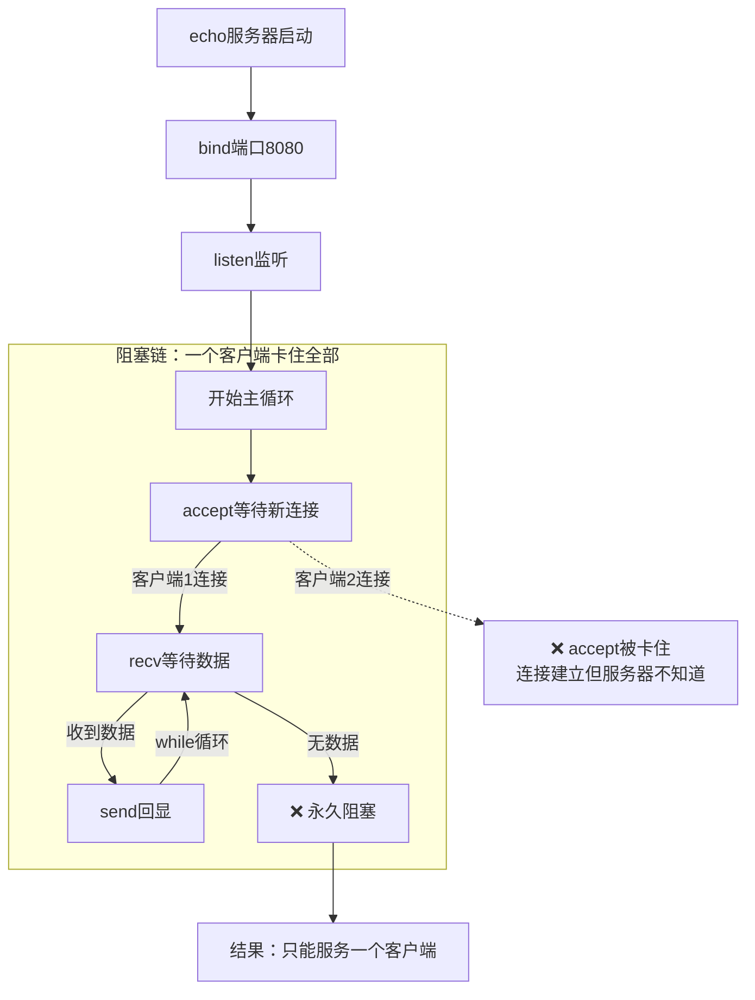

## 第一阶段echo服务器流程图

## 函数调用流程
Echo服务器调用树
├──1. 构造函数（编译器生成的代码自动调用）
├──2. start()（用户调用）
│   ├── setupSocket()
│   │   ├── socket()                创建套接字
│   │   ├── setsockopt(SO_REUSEADDR) 地址重用
│   │   ├── htons()                 端口字节序转换
│   │   ├── bind()                  绑定地址
│   │   └── listen()                开始监听
│   │
│   ├── acceptClient()
│   │   ├── accept()                接受连接（阻塞）
│   │   ├── inet_ntop()             IP转字符串
│   │   └── ntohs()                 端口转换
│   │
│   └── handleClient()
│       └── while循环
│           ├── recv()              接收数据
│           └── send()              发送数据
│
├
│
└──3. 析构函数（自动）── stop()
                        └── cleanup()
                            ├── close(client_socket)   关闭客户端连接
                            └── close(server_socket)   关闭服务器
