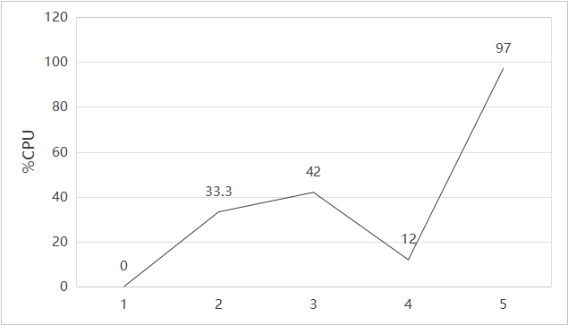

# 连续两次QPS暴跌95%：一次性能排查与宿主机-网络-容器全链路分析以及调参如何影响select模型

本篇文章有图有字有数据，除了排查过程还可以搞懂8个问题与n个细节：

1. 当我们压测时，宿主机到容器再回到宿主机的全链路到底都发生了什么？都在哪里、产生了多少、如何计算的预测性能损耗？docker负责什么？以及程序都有可能在哪里崩塌？
2. 内核参数改动如何在全链路中起到重要作用？什么时候调参是必要手段而非优化手段？

## 第一次QPS从8500暴跌至400+

### 前提引入

在第一阶段的echo阻塞IO服务器完成后我进入了第二阶段，引入select多路复用，本想迅速产出《select瓶颈分析》的我先对代码进行了适当重构，拆分了业务逻辑与网络库，并将测试环境从宿主机本地回环更改为从宿主机去压测容器服务，根据本地回环8.5k的QPS，由于docker-proxy会有一定性能损耗，所以我预期看见约为6k-8k的QPS，数据却显示：400+ QPS？性能整整下降了95%！于是有了这篇博客。

### 三个数据现象

1. 宿主机本地回环测试正常
（待测数据）
2. 容器内本地回环测试正常
（待测数据）
3. 从宿主机压测容器服务数据异常暴跌
（待测数据）
### 修复思路

(1) 两种本地回环数据均正常，排除**程序本身的问题**
(2) 数据暴跌20倍，排除普通的**环境数据损耗**

(3) CPU被其他进程限制
猜测：是否容器CPU限制太死，因为我昨天刚在docker-compose.yml里面把CPU限制为4核，或者其他进程占用了CPU
思考：目前源码为单线程，所以QPS取决于单核性能，与宿主机的12核或者容器内4核无关，QPS理论值应为宿主机QPS的8500，**并且我当时认为总CPU使用率的理论最大值为25%(相对4核而言，单线程最多能跑满1核)**，实际上这里的CPU使用率指的就是
验证：这里用到top，'watch -n 1 'docker exec im-gateway-test top -bn1 | head -20'，观看压测时容器内的总CPU使用率
预期：想看见CPU使用率从始至终严重低于25%，有别的进程占用容器内单核CPU
现象：

    PID USER      PR  NI    VIRT    RES    SHR S  %CPU  %MEM     TIME+ COMMAND

      1 appuser   20   0    6056   3584   3456 S   0.0   0.0   0:12.50 TCPserv+

    427 appuser   20   0    7184   3072   2688 R   0.0   0.0   0:00.04 top
    
我们要看的那一栏是CPU%，我没有保留具体输出结果，这里用折线图看一下观察到的数据趋势

CPU使用率与想象中完全不同，时而33.3%时而飙到97%

### 错误总结与反思

1. 认知问题：没有分清楚系统CPU使用率和进程CPU使用率，在我的单线程select模型下，进程CPU使用率是可以接近100%的，而系统CPU使用率则是可以接近25%
2. 习惯问题：

其实这是我第一次进行性能排查，几乎没有任何经验与直觉，在排查完后依然觉得模糊不清。于是我先试图开始理清从脚本在运行到压测结束，中间发生了什么。也就是当我运行脚本后：

**当wrk以100并发进行测试时，数据宿主机到容器再回到宿主机的流动全链路是在哪一步崩塌的？**

我们需要先知道wrk与服务器建立TCP连接并发送一个HTTP请求，再收到服务器的HTTP响应，走完这一趟请求需要14个左右的数据包，两个TCP握手是6个，HTTP的请求-响应是8个，涉及SYN、ACK、PUSH等等不同的包，而我们在讲解wrk-docker proxy-TCPserver全链路时为了简化，以下统称为数据包。

1. 压测脚本运行→调用wrk，wrk→触发系统调用，CPU→从用户态切换至内核态

2. 宿主机内核TCP层的发送端→检查处理数据包，并发送给内核IP层

3. 宿主机内核IP层**发送端**→进行路由决策，路由查找，发现可以进行本地回环，于是将数据包交给 lo 设备的发送队列（本地回环的优化）

5. 宿主机内核IP层**接受端**→接收并处理lo设备接收队列的数据包

6. 宿主机内核TCP层→接收检查处理数据包，根据连接跟踪表查找IP与端口对应的socket，找到docker-proxy进程的socket，把数据包放到这个socket队列，以此触发唤醒机制

7. CPU调度器→唤醒docker-proxy进程：
原先进程处于TCP全连接队列中，状态为TASK_INTERRUPTIBLE可中断休眠状态，现被CPU调度器唤醒。
因为docker-proxy底层用的是阻塞IO模型，所以这里本质上是docker-proxy内部accept()阻塞，对阻塞本质与唤醒机制感兴趣可以参考我的第一篇博客去了解accept阻塞本质又是什么。

8. docker-proxy运行→程序触发系统调用并发出响应数据包，目标IP？CPU从用户态切换至内核态

9. 宿主机内核TCP层→接受并处理响应数据包

10. 宿主机内核IP层→进行路由决策，路由查找，发现可以进行本地回环，于是直接调用本机IP接收函数（loopback优化），无需出IP层

11. 宿主机内核链路层的发送端→特殊处理lo路径数据包，将其放至内核IP层的lo设备接收队列

12. 宿主机内核IP层→进行路由决策，路由查找，发现目标IP为容器IP172.17.0.2，通过docker0网桥到达虚拟网卡vethxxx

13. 宿主机虚拟网卡vethxxx→将数据包传递给虚拟网线veth_path，到达docker网桥0

docker网桥0→根据MAC地址表找出172.17.0.2对应的veth设备，把数据包发给容器虚拟网卡vethyyy

7. 容器内TCP协议栈→检查处理数据包

8. CPU调度器→唤醒原先因为没有数据处于TASK_INTERRUPTIBLE的TCPserver进程

9. 程序在容器内运行，触发系统调用，CPU→从用户态切换至内核态

----------------------------------再走一遍对称的路-----------------------------------------

11. TCP服务器→处理请求并发出响应数据包

10. 容器内协议栈TCP协议栈→检查处理数据包

11. IP层→进行路由决策，发现目标IP非127.0.0.1，不进行容器内本地回环

12. 容器虚拟网卡vethyyy→将数据包发至docker网桥0

docker网桥0→通过虚拟网线veth_path传递给宿主机虚拟网卡vethxxx

13. 内核IP层的Netfiler→触发POSTROUTING钩子

POSTROUTING钩子→触发iptables规则中的SNAT规则

SNAT规则→将数据包目标IP由172.17.0.2改回127.0.0.1

14. 内核→将数据包传递回IP层

15. 内核IP层→路由决策，路由查询，发现可以进行**本地回环**，于是直接调用本机的IP接收函数（loopback优化）】

16. 内核链路层→特殊处理lo路径数据包，将其放至内核IP层的lo设备接收队列

16. 内核IP层→接收并处理数据包

16. TCP层→检查处理数据包，将wrk进程的socket，把数据包放到这个socket队列，以此触发wrk唤醒机制

17. CPU调度器→唤醒wrk进程

18. wrk→读取数据并且统计QPS

### 排查过程与解决

### 修复后的commit message：

commit 5c74ce
作者: lizining1231 lizining1231@outlook.com
日期: 2026年2月19日 周四 22:57:56 +0800

fix(Docker): 解决因**docker-proxy 未启动**导致 QPS 降至 100+ 的问题

    • 问题: 在100并发下，本地主机访问达到8500 QPS，而从主机访问容器仅为187 QPS；尽管设置了4核限制，CPU使用率仍超过33.3%且不稳定。
    • 原因: 在 docker-compose 中错误使用了 deploy.resources（该配置仅在 swarm 模式下生效）；错误的端口映射导致 docker-proxy 未启动。
    • 复现步骤:

    在 docker-compose.yml 中使用 deploy.resources

    启动容器: docker compose up -d

    验证 docker-proxy 缺失: ps aux | grep docker-proxy

    运行压力测试: wrk -t12 -c100 http://localhost:18080
    • 修复方案:

    将 deploy.resources 替换为标准 cpus 格式

    重建容器: docker compose down && docker compose up -d

    调整内核参数优化:
    sudo sysctl -w net.ipv4.tcp_tw_reuse=1
    sudo sysctl -w net.ipv4.tcp_fin_timeout=30
    • 结果: QPS从187恢复至10210，达到预期的4核容器性能。

## 修复QPS至1w+后隔天测试再次暴跌至400+

### 前提引入
在QPS恢复至1w+后，第二天打开电脑，又跑了一次脚本，令人绝望的是，数据再次跌回400+
### 数据现象

### 修复思路

1. 先查看是不是上次的修改重启后失效了
2. 其次考虑是否为环境、编译器缓存残留
3. 最后如果都不行就重新排查

### 排查过程与解决

• 先用查看docker-proxy是否在运行✅

在运行，如下：
lizining@Y:~/projects/cpp-im-gateway$ **docker ps**

CONTAINER ID   IMAGE                       COMMAND                  CREATED        STATUS          PORTS                                           NAMES
893898753d68   cpp-im-gateway-im-gateway   "/app/entrypoint.sh …"   35 hours ago   Up 12 seconds   0.0.0.0:18080->8080/tcp, [::]:18080->8080/tcp   im-gateway-test

lizining@Y:~/projects/cpp-im-gateway$ **docker port im-gateway-test**
8080/tcp -> 0.0.0.0:18080
8080/tcp -> [::]:18080

lizining@Y:~/projects/cpp-im-gateway$ **ps aux | grep docker-proxy**
root        9661  0.0  0.0 1746984 4480 ?        Sl   14:46   0:00 /usr/bin/docker-proxy -proto tcp -host-ip 0.0.0.0 -host-port 18080 -container-ip 172.18.0.2 -container-port 8080 -use-listen-fd
root        9668  0.0  0.0 1746984 4352 ?        Sl   14:46   0:00 /usr/bin/docker-proxy -proto tcp -host-ip :: -host-port 18080 -container-ip 172.18.0.2 -container-port 8080 -use-listen-fd
lizining   10759  0.0  0.0   4096  1920 pts/4    S+   14:47   0:00 grep --color=auto docker-proxy

• 查看docker-compose是否为标准 cpus 格式✅

是，如下：
services:
  im-gateway:
    build: .
    container_name: "im-gateway-${NODE_ENV:-test}"
    ports:
      - "${EXTERNAL_PORT:-18080}:${PORT:-8080}"
    
    # 资源限制
    cpus: 4
    mem_limit: 2g
    mem_reservation: 1g

• 查看参数优化是否还在❌
验证：sysctl net.ipv4.tcp_tw_reuse
net.ipv4.tcp_tw_reuse = 2（默认值）

验证：sysctl net.ipv4.tcp_fin_timeout
net.ipv4.tcp_fin_timeout = 60（默认值）
内核参数不在了！

于是我立即把参数调整为昨天的，
sudo sysctl -w net.ipv4.tcp_tw_reuse=1
sudo sysctl -w net.ipv4.tcp_fin_timeout=30

重新设置内核参数后，数据再次恢复至1w+
[1/5] 预热环境 (60秒)
✓ 预热完成

[2/5] 基准测试 (100并发)
  QPS: 11106.67

[3/5] 阶梯加压测试
--- 测试 100 并发 ---
  **QPS: 10455.17**  延迟:  9.07ms  P99: 14.03ms  
``
### 修复后的commit message

fix(sysctl): 解决因参数优化失效导致QPS再次降低至400+的问题
• 问题：修复上一次QPS暴跌的一天后，在100并发下，本地主机访问达到8500 QPS，而从宿主机测试容器内服务则暴跌至400+。
• 原因: net.ipv4.tcp_tw_reuse和net.ipv4.tcp_fin_timeout在重启后恢复默认值
• 修复方案：

1. 创建独立配置文件etc/sysctl.d/99-local.conf，使得重启后参数仍然有效
2. 在项目内备份内核参数配置config/99-local.conf

• 结果: QPS从478恢复至10210，达到预期的性能。
• 反思：
1. 第一次修复时的数据多次测试实为400+，在commit message中仅采取了第一次测试数据187
2. 第一次修复不应该同时做"docker-proxy未启动"与"内核参数优化"两件事情，导致归因错误（归因为docker-proxy未启动）
3. 没有理解内核参数优化的重要性，以为仅仅是优化数据，实际上有时候是支撑系统
• 复现步骤:
1. 回滚
git reset --soft 5c74ce
2. 恢复参数默认值
sudo sysctl -w net.ipv4.tcp_tw_reuse=2
sudo sysctl -w net.ipv4.tcp_fin_timeout=60

## 疑惑1：参数如何在这个链路中起到如此大的作用的？

## 疑惑2：如果是内核参数原因，为何本地回环没有受影响？

我们来看一看当内核参数修改后，两种本地回环的数据如何：

1. 宿主机本地回环测试

2. 容器内本地回环测试

## 疑惑3：难道docker-proxy就没错吗？

## 补充：测试环境、方法说明

## 前置知识点

