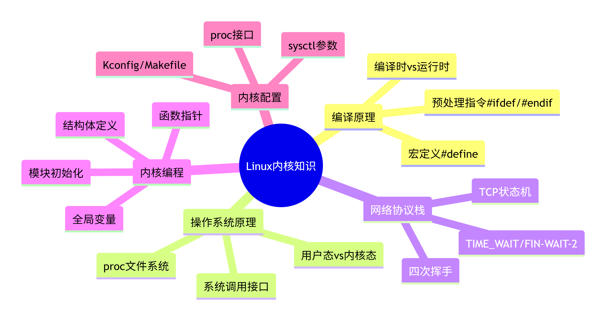

本文主要放一些对于该项目的疑惑、以及一些基础知识的问答，用于我自己面试前使用
## 决策：未来必须替换 select 为 epoll

### 理由：select 的 API 设计强制污染上层架构

在实现 ConnManager 和 SelectPoller 的职责分离时，遭遇了 select 的 max_fd 维护问题。

select 要求调用者传入当前监控的最大 fd 值。这个值的维护逻辑需要：
1. 遍历所有活跃连接的 fd 列表
2. 在连接增删时更新缓存

无论将这份逻辑放在 ConnManager 还是 SelectPoller，都会导致：
- 若放在 SelectPoller：Poller 被迫持有业务层的 fd 列表，职责过重
- 若放在 ConnManager：ConnManager 被迫维护一个与 I/O 机制强相关的衍生数据，职责污染
- 若两者共享：引入不必要的生命周期耦合和状态同步风险

**这不是设计问题，是 select 的 API 缺陷。**

epoll 在内核维护事件表，epoll_wait() 无需 max_fd 参数，天然不存在此问题。

### 结论

当前阶段容忍 select 带来的架构妥协，将 max_fd 计算逻辑临时放置在 ConnManager 中。
未来引入 EpollPoller 时，该部分代码将作为"select 专属技术债"被整体移除。


## 决策日志：select 的遍历需求导致封装泄漏

### 痛点描述

在实现 `TCPServer::eventLoop` 时，需要遍历所有活跃的 fd，逐个检查是否就绪：

```cpp
for (int fd : poller.client_fds) {      // ← 被迫公开 client_fds
    if (poller.isReady(fd)) {
        handleClientData(fd);
    }
}
```
# 根源分析

| 根本原因 | 说明 |
| :--- | :--- |
| select 的返回机制 | `select()` 返回后只修改 `fd_set` 位图，**不返回就绪 fd 列表** |
| 轮询检查 | 调用者必须遍历所有可能的 fd，用 `FD_ISSET` 逐个询问 |
| 列表归属问题 | 这个"所有可能的 fd"列表，天然属于 I/O 复用器（`SelectPoller`），但遍历需求来自上层（`TCPServer`） |
| 封装泄漏 | 为了让上层能遍历，`SelectPoller` 被迫将内部数据 `client_fds_` 暴露为 `public` |

# 为什么这是 select 特有的问题

| 对比项 | select | epoll |
| :--- | :--- | :--- |
| 事件等待 | `select(max_fd+1, &read_fds, ...)` | `epoll_wait(epfd, events, MAX, timeout)` |
| 就绪 fd 获取方式 | 遍历所有 fd，逐个 `FD_ISSET` | `events[i].data.fd` 直接获取 |
| 是否需要维护 fd 列表 | 必须，用于遍历 | 不需要，内核维护 |
| 封装性 | 泄漏，被迫暴露列表 | 完好，无内部列表需暴露 |

# 临时妥协

当前阶段容忍 `client_fds_` 的 `public` 暴露，以优先跑通核心逻辑。

待 `ConnManager` 完善后，将改为**方案二**：`SelectPoller::wait()` 直接返回就绪 fd 列表，届时 `client_fds_` 可恢复为 `private`。

# 复仇计划

引入 `EpollPoller` 后：

- `SelectPoller` 整体删除
- `client_fds_` 随之消失
- `max_fd` 随之消失
- `FD_ISSET` 轮询随之消失
- 遍历需求彻底消灭


# 学习资料
书籍：《深入理解操作系统》《自顶向下：计算机网络》《数据结构与算法》
源码：
操作系统相关：Linux
网络库相关：muduo、Envoy、Asio、
协程相关：libco

1. 你为什么要做这个项目?

2. 这不是仿写网络编程书籍吗？不是仿写muduo吗？

非常好的思路——你不想要现成方案，而是希望自己推导出设计。这说明你已经有了架构师的思维方式。我来引导你一步步拆解。

---


## 第一个问题：命名即意图

你说不喜欢 `TCPServer` 这个类名，因为它暗示了“这是一个服务器”而不是“这是一个库”。

**思考题**：如果把这个类改名，改成什么名字能准确表达“它只是一个调度器，负责把事件交给正确的处理者”？

提示：它的核心职责是什么？它管理了一个事件循环，它持有 `map<fd, connection>`，它知道如何 accept 新连接。但这些职责中，哪些是“服务器特有的”，哪些是“任何基于事件驱动的网络程序都需要的”？

回答：😵‍💫😵‍💫老师，我不知道，你说调度器我觉得它应该叫做schedule，但是我突然觉得网络库的核心应该是evenloop，不应该存在一个TCPserver，但我又希望有一个东西去把Connection管理好。你这么一问我觉得我首要应该把evenloop拆出来，单独作为一个类，而不是作为TCPserver的函数
---

## 第二个问题：谁在掌控一切？

当前的设计中，`TCPServer` 似乎处于顶层，它创建并持有所有东西。但你的目标是做一个**库**，库和应用程序的区别是什么？

-   应用程序：`main` 函数是你的，你调用库的 API，你掌控主流程。
-   库：应用程序的 `main` 调用库的 API，**但事件循环运行时，谁在掌控主流程？**

**思考题**：在库的使用场景下，是库的 `event_loop_run()` 在循环，还是应用程序的 `main` 在循环？如果是库在循环，应用程序的业务逻辑如何被“插入”到循环中？

提示：回想一下你使用过的库——`libevent`、`libuv`、`netty`——它们的典型用法是什么样的？是应用程序调用 `loop.run()` 然后库回调应用程序，还是应用程序自己写 `while` 循环？

我觉得是evenloop在循环，在我的实现里面，应用程序的业务逻辑是可以被“插入”到循环中的，我的evenloop里面调用了handleClient，handleClient里面有涉及到recv数据，交给buffer类的方法处理数据，然后send数据前要经过业务逻辑，这里业务逻辑就是一个回调，用户可以自定义。
---

## 第三个问题：依赖的方向

你目前的依赖关系大致是：

```
TCPServer -> Socket
TCPServer -> Connection -> Buffer
```

`TCPServer` 知道一切，依赖一切。这会导致什么问题？

**思考题**：如果未来你想支持 UDP，你需要新增一个 `UDPServer` 类吗？它的代码和 `TCPServer` 会有多少重复？如果支持 TLS，`TCPServer` 要不要知道 TLS 的存在？

提示：一个好的分层设计中，**依赖应该指向抽象，而不是具体**。高层模块不应该依赖底层模块的实现细节。那么在你的设计中，哪一层是“高层”，哪一层是“底层”？当前的设计中，依赖方向是从上往下还是从下往上？

呃，嘶，我感觉肯定是大量重复的，实际上我的TCPserver只是一个空壳，关于协议的选择似乎在Socket里面，只不过TCPserver又把socket的init给括入囊中了。我希望的实现是无论采取什么协议，TCPserver都不用变动？底层就是具体的initSocket、acceptClient，handleClient之类的吧？那我怎么办，把这几个函数做好，参数设置好，暴露给用户？这样他们就可以自定义TCP或者UDP

---

## 第四个问题：连接是如何被“发现”的？

当前：`TCPServer` 有一个 `map<fd, connection>`，它自己管理连接的生命周期。

**思考题**：这个 map 的存在，意味着 `TCPServer` 知道“哪些 fd 是活跃的连接”。但 `event_loop` 也知道哪些 fd 是活跃的（因为 select 返回了可读/可写的 fd 集合）。这两个“活跃集合”之间有关系吗？为什么不能让 `event_loop` 直接管理 fd 到 connection 的映射？

提示：如果你把 `map<fd, connection>` 移到 `event_loop` 中，`TCPServer` 还剩下什么？
啊，我感觉，我感觉你这么一说TCPserver可以不存在了，可是，我又会觉得evenloop职责有点重了，它难道不该专注于循环，还有循环相关的内部实现和方法吗？
---

## 第五个问题：职责分离的边界

目前 `TCPServer` 做了这些事：

1.  初始化 Socket（绑定、监听）
2.  运行 select 循环
3.  调用 `acceptClient()` 接受新连接
4.  调用 `handleClient()` 处理已连接的事件
5.  管理 `map<fd, connection>`
6.  当连接关闭时，从 map 中删除

**思考题**：如果让你把这些职责分给三个不同的类，你会怎么分？哪几个职责是“必须在一起的”，哪几个可以分开？

啊，居然需要分给三个不同的吗?那我觉得accept和handle这两个都是很底层的实现，分给evenloop？select循环也在evenloop，完了完了，怎么觉得又变成evenloop职责过重了。我觉得欸，我觉得5.  管理 `map<fd, connection>`这个不能给connection，应该有一个比connection更高层的来管理，比如TCPserver。然后连接关闭从map中删除也是高层管理，因为connection也不知道map的存在啊。

提示：思考“不变”和“可变”的分离。哪些部分在网络库的所有应用中几乎一样？哪些部分因应用而异（比如协议解析、业务逻辑）？

我觉得select的初始工作，accept、recv相关的工作还有错误处理应该几乎都是一模一样的，但是涉及到协议解析比如Buffer缓冲区粘包处理就是因业务逻辑而异，然后业务逻辑肯定是各不相同的嘛。
---

## 第六个问题：用户需要什么？

最终，你的库的用户（也就是你自己或其他开发者）想写出什么样的代码？

**思考题**：对比两种用法，你更倾向于哪种？

**用法 A**（当前模式，黑盒）：

```cpp
MyServer server;
server.onMessage([](Connection* conn, Buffer* data) {
    // 业务逻辑
});
server.listen(8080);
server.start();  // 阻塞，再也不会返回
```

**用法 B**（更灵活）：

```cpp
EventLoop loop;
TcpListener listener(8080);
listener.onAccept([](int fd) {
    Connection* conn = new Connection(fd);
    conn.onRead(...);
});
loop.addFd(listener.fd(), EVENT_READ);
loop.run();
```

**思考题**：用法 A 更简单，但限制了用户能做的事情（比如用户无法同时跑两个监听端口，无法在运行中动态添加其他 fd）。用法 B 更灵活，但用户需要写更多代码。一个网络库应该在“简单性”和“灵活性”之间如何取舍？

我当然需要更灵活，但也不想太灵活，但是现在这个完全就是服务器，你说到用户无法同时跑两个监听端口，无法在运行中动态添加其他 fd之类的，实际上我都不知道我的网络库可以被用户用来干嘛，我的示例从来都是echo和HTTP，灵活度很低
---

## 我的建议

先不要急着写代码。拿一张纸，把这六个问题的答案写下来。当你对每个问题都有清晰的想法后，再画出新的类图。我建议的思考顺序是：

1.  先回答第一个问题：新的核心类叫什么？（这个答案会定义你的库的“叙事”）
2.  再回答第三、第五个问题：搞清楚职责边界。
3.  然后回答第六个问题：确定用户 API 的风格。
4.  最后用第二、第四个问题来验证你的设计是否自洽。

把答案告诉我，我们再一起推演你的设计方案是否合理。

最终我的想法是（我很不确定）
1. 先把evenloop从TCPserver里面拿出来，作为一个类
2. 原先TCPserver负责的事务比如acceptClient、handleClient都挪到evenloop底下
3. TCPserver先改个名字，呃，叫什么呢，schedule？我这里最没想清楚，可以先叫schedule然后内部只剩下维护一个map管理连接，说不定之后有用

